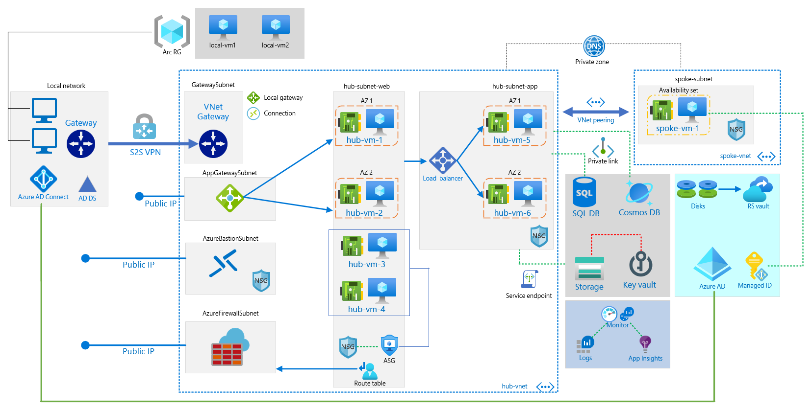

# Microsoft Azure Classroom Reference Diagrams

The purpose of these diagrams is to help you demonstrate several Azure products in a confined space.

I give you permission to use or adapt these diagrams for your own professional purposes. Please feel free to submit changes or new diagrams to this repository via pull request.

For attribution, simply link to my website ([**techtrainertim.com**](https://techtrainertim.com)) or my Twitter account ([@TechTrainerTim](https://twitter.com/techtrainertim)). Thanks! -Tim Warner

## Formats

To edit my diagrams, you'll need [Microsoft Visio](https://products.office.com/en-us/visio/flowchart-software) or an application that can handle .vsdx drawing files.

